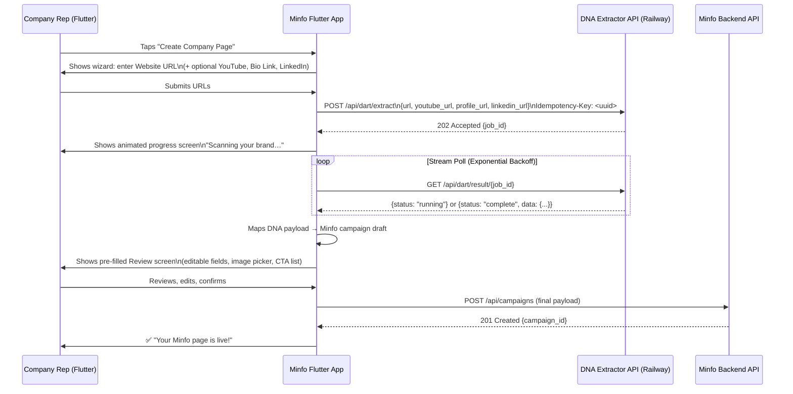

# Minfo Flutter App ↔ Website DNA Extractor — Integration Architecture

## Recommended Approach: **Async Pre-fill + Human Review**

The DNA Extractor is a *draft generator*, not a fully autonomous publisher.
The optimal Flutter UX is a **one-tap "import from website" wizard**
that pre-populates the new Minfo page form, then lets the company rep
review and publish.

---

## Architecture Overview



---

## Why Async + Review (not direct auto-publish)?

| Option | Pros | Cons |
|--------|------|------|
| **Async Pre-fill + Review** ✅ | Safe, trustworthy, user in control | Extra screen in wizard |
| Direct auto-publish | Fastest | Wrong brand colors, bad images, duplicate CTAs |
| Sync API call | Simpler code | 60–90s wait blocks UI, timeouts on slow sites |

The DNA extractor takes **30–90 seconds**. Flutter's UI must be async-first, and robust against networking interruptions.

---

## Dart Service Layer

### 1. API Client (`dna_service.dart`)

> **Security Hardening**: Do not compile static API keys into the mobile binary. Proxy auth via the Minfo Backend or request short-lived JWTs. Maintain a single `http.Client` instance.

```dart
import 'dart:async';
import 'dart:convert';
import 'package:http/http.dart' as http;
import 'package:uuid/uuid.dart';

class DnaExtractionService {
  static const String _baseUrl = 'https://website-dna-extractor.railway.app';
  static const Duration _timeout = Duration(minutes: 3);
  final http.Client _client = http.Client(); // Reuse TLS connections

  Future<Map<String, String>> get _headers async => {
    'Content-Type': 'application/json',
    'Authorization': 'Bearer ${await _getMinfoAuthToken()}', // Fetch JWT dynamically
  };

  /// Starts an extraction job and returns the job_id immediately.
  Future<String> startExtraction({
    required String websiteUrl,
    String? youtubeUrl,
    String? profileUrl,
    String? linkedinUrl,
  }) async {
    final body = {
      'url': websiteUrl,
      if (youtubeUrl?.isNotEmpty ?? false) 'youtube_url': youtubeUrl,
      if (profileUrl?.isNotEmpty ?? false) 'profile_url': profileUrl,
      if (linkedinUrl?.isNotEmpty ?? false) 'linkedin_url': linkedinUrl,
    };

    final res = await _client.post(
      Uri.parse('$_baseUrl/api/dart/extract'),
      headers: {
        ...(await _headers),
        'Idempotency-Key': const Uuid().v4(), // Prevent double-billing
      },
      body: jsonEncode(body),
    ).timeout(const Duration(seconds: 15));

    if (res.statusCode != 202) {
      throw DnaException('Failed to start extraction: ${res.statusCode} ${res.body}');
    }

    final json = jsonDecode(res.body) as Map<String, dynamic>;
    return json['job_id'] as String;
  }

  /// Streams extraction status, allowing UI to subscribe and safely dispose.
  Stream<DnaJobStatus> watchJob(String jobId, {CancelToken? cancel}) async* {
    Duration backoff = const Duration(seconds: 2);
    final deadline = DateTime.now().add(_timeout);

    while (DateTime.now().isBefore(deadline)) {
      cancel?.throwIfCancelled();
      
      final res = await _client.get(
        Uri.parse('$_baseUrl/api/dart/result/$jobId'),
        headers: await _headers,
      ).timeout(const Duration(seconds: 10));

      if (res.statusCode == 429) {
        final retry = int.tryParse(res.headers['retry-after'] ?? '') ?? 30;
        await Future.delayed(Duration(seconds: retry));
        continue;
      }

      final json = jsonDecode(res.body) as Map<String, dynamic>;
      final status = json['status'] as String?;
      yield DnaJobStatus.fromJson(json);

      if (status == 'complete') return;
      if (status == 'failed' || status == 'cancelled') {
        throw DnaException(json['detail'] as String? ?? 'Extraction $status');
      }

      final retryAfter = int.tryParse(res.headers['retry-after'] ?? '');
      final wait = retryAfter != null ? Duration(seconds: retryAfter) : backoff;
      backoff = Duration(milliseconds: (backoff.inMilliseconds * 1.5).round().clamp(2000, 10000));
      await Future.delayed(wait);
    }
    throw DnaException('Extraction timed out');
  }
}
```

---

### 2. Data Model (`dna_result.dart`)

> **Stability Hardening**: Defensive parsing is required. Never trust API types absolutely. Use null-guards and avoid throwing on missing elements in lists.

```dart
class DnaResult {
  final String? name; // ALWAYS provide a fallback (e.g. URI host) if null
  final String? logoUrl;
  final String? screenshotUrl;
  final String  campaignDescription; 
  final String  backgroundColor;
  final String  foregroundColor;
  final String  appBarBackgroundColor;
  final String  appBarForegroundColor;
  final String  accentColor;
  final List<DnaButtonStyle>  buttonStyles;
  final List<DnaCta>          allCtas;
  final List<String>          socialLinks; 
  final List<String>          placeholderImages;
  final LinkedinData?         linkedinData;

  const DnaResult({
    this.name,
    this.logoUrl,
    this.screenshotUrl,
    required this.campaignDescription,
    required this.backgroundColor,
    required this.foregroundColor,
    required this.appBarBackgroundColor,
    required this.appBarForegroundColor,
    required this.accentColor,
    required this.buttonStyles,
    required this.allCtas,
    required this.socialLinks,
    required this.placeholderImages,
    this.linkedinData,
  });

  factory DnaResult.fromJson(Map<String, dynamic> j) {
    if (j['data'] is! Map) throw DnaException('Invalid payload');
    final data = j['data'] as Map<String, dynamic>;

    List<T> safeList<T>(dynamic list) => (list as List? ?? []).whereType<T>().toList();

    // Deduplicate social links safely
    final allSocial = <String>{
      ...safeList<String>(data['social_media_links']),
      ...safeList<String>(data['youtube_social_links']),
      ...safeList<String>(data['profile_social_links']),
    }.toList();

    // Merge CTAs
    final ctas = <DnaCta>[
      ...safeList<Map>(data['website_ctas']).map((m) => DnaCta.fromJson(Map<String,dynamic>.from(m))),
      ...safeList<Map>(data['youtube_ctas']).map((m) => DnaCta.fromJson(Map<String,dynamic>.from(m))),
      ...safeList<Map>(data['profile_ctas']).map((m) => DnaCta.fromJson(Map<String,dynamic>.from(m))),
    ];

    return DnaResult(
      name: data['name'] as String?,
      logoUrl: data['logo_url'] as String?,
      screenshotUrl: data['screenshot_url'] as String?,
      campaignDescription: data['campaign_description'] ?? data['website_summary'] ?? '',
      backgroundColor: data['background_color'] ?? '#FFFFFF',
      foregroundColor: data['foreground_color'] ?? '#000000',
      appBarBackgroundColor: data['background_app_bar_color'] ?? data['background_color'] ?? '#000000',
      appBarForegroundColor: data['foreground_app_bar_color'] ?? '#FFFFFF',
      accentColor: data['icon_background_color_left'] ?? '#f99d32',
      buttonStyles: safeList<Map>(data['button_styles']).map((m) {
        try { return DnaButtonStyle.fromJson(Map<String,dynamic>.from(m)); } 
        catch (_) { return null; }
      }).whereType<DnaButtonStyle>().toList(),
      allCtas: ctas,
      socialLinks: allSocial,
      placeholderImages: safeList<String>(data['placeholder_images']),
      linkedinData: j['linkedinData'] != null ? LinkedinData.fromJson(Map<String,dynamic>.from(j['linkedinData'])) : null,
    );
  }
}

class LinkedinData {
  final String? avatarUrl;
  final String? name;
  final String? headline;
  final String? description;

  LinkedinData({this.avatarUrl, this.name, this.headline, this.description});

  factory LinkedinData.fromJson(Map<String, dynamic> j) => LinkedinData(
    avatarUrl: j['avatarUrl'] as String?,
    name: j['name'] as String?,
    headline: j['headline'] as String?,
    description: j['description'] as String?,
  );
}

class DnaCta {
  final String buttonName;
  final String url;
  DnaCta({required this.buttonName, required this.url});
  factory DnaCta.fromJson(Map<String, dynamic> j) =>
      DnaCta(buttonName: j['button_name'] ?? j['url'], url: j['url'] ?? '');
}

class DnaButtonStyle {
  final String? backgroundColorHex;
  final String? textColorHex;
  final int     shapeInt;         // 1=Square 2=Rounded 3=Pill
  final String? fontFamily;
  
  DnaButtonStyle({this.backgroundColorHex, this.textColorHex, required this.shapeInt, this.fontFamily});
  
  factory DnaButtonStyle.fromJson(Map<String, dynamic> j) => DnaButtonStyle(
    backgroundColorHex: j['background_color_hex'] as String?,
    textColorHex:       j['text_color_hex'] as String?,
    shapeInt:           (j['shape_int'] as num?)?.toInt() ?? 2,
    fontFamily:         j['font_family'] as String?,
  );
}
```

---

### 3. Review Screen — Field Mapping to Minfo Campaign

| DNA Extractor field | Minfo Campaign field | Notes |
|---|---|---|
| `name` | `campaign.name`, `brand.name` | Pre-fill, **fallback to domain if null** |
| `campaign_description` | `campaign.campaignDescription` | Send as plain text! Minfo must sanitize and wrap in HTML server-side to prevent XSS. |
| `logo_url` | `campaign.image`, `brand.logo` | Show in header preview |
| `linkedinData.avatarUrl`| `productImages[]` | Append to selectable image grid |
| `linkedinData.description`| Optional override | Offer as an alternative summary text option |
| `background_color` | `campaign.backgroundColor` | Show colour swatch |
| `button_styles[0].shapeInt` | `button.shape` | **Enums:** `1=Square`, `2=Rounded`, `3=Pill` |
| `website_ctas[]` | `campaignItemButtons[]` | `buttonType: 4` (URL) |
| `social_media_links[]` | `medialinks[]` | Map via strict `buttonCategoryId` parser |

#### Secure Social `buttonCategoryId` map
> **Hardened:** Use `Uri.parse().host.endsWith()` instead of `.contains()` to prevent false positives (e.g. `myinstagram-fanclub.com`).

```dart
int socialCategoryId(String url) {
  try {
    final host = Uri.parse(url).host.toLowerCase();
    if (host.endsWith('facebook.com'))  return 1;
    if (host.endsWith('twitter.com') || host.endsWith('x.com')) return 2;
    if (host.endsWith('instagram.com')) return 3;
    if (host.endsWith('youtube.com'))   return 4;
    if (host.endsWith('linkedin.com'))  return 5;
    if (host.endsWith('tiktok.com'))    return 6;
    if (host.endsWith('pinterest.com')) return 7;
    return 8; // Website / other
  } catch (_) {
    return 8;
  }
}
```

---

### 4. Campaign Payload Builder (`campaign_builder.dart`)

```dart
Map<String, dynamic> buildMinfoPayload(DnaResult d, {
  required String websiteUrl,
  required List<String> selectedImages,
  required List<DnaCta> selectedCtas,
  required String description,
}) {
  final domainFallback = Uri.tryParse(websiteUrl)?.host ?? 'Unknown Brand';
  final safeName = d.name ?? domainFallback;

  final medialinks = <Map<String, dynamic>>[
    if (websiteUrl.isNotEmpty) {
      'name': 'Website',
      'icon': '',
      'link_url': websiteUrl,
      'buttonCategoryId': 8,
      'modelorder': 1,
    },
    ...d.socialLinks.asMap().entries.map((e) => {
      'name': Uri.tryParse(e.value)?.host.replaceFirst('www.', '').split('.').first ?? 'Social',
      'icon': '',
      'link_url': e.value,
      'buttonCategoryId': socialCategoryId(e.value),
      'modelorder': e.key + 2,
    }),
  ];

  final buttons = selectedCtas.asMap().entries.map((e) => {
    'name': e.value.buttonName,
    'buttonType': 4,
    'modelorder': e.key + 1,
    'backgroundColor': d.accentColor,
    'foregroundColor': '#FFFFFF',
    'properties': [{'propertyDefinitionId': 20, 'propertyValue': e.value.url, 'propertyName': 'URL'}],
    'shape': d.buttonStyles.firstOrNull?.shapeInt ?? 2,
    'buttonAlign': 2, // 1=Left, 2=Center, 3=Right
    'textAlign': 2,   // 1=Left, 2=Center, 3=Right
    'enabled': true,
  }).toList();

  return {
    'campaign': {
      'name': safeName,
      'campaignDescription': description, // Send plain text!
      'backgroundColor': d.backgroundColor,
      'foregroundColor': d.foregroundColor,
      'appbarBackgroundColor': d.appBarBackgroundColor,
      'appbarForegroundColor': d.appBarForegroundColor,
      'image': d.logoUrl ?? '',
      'campaignType': 1,
      'scanType': 0,
      'displayInSearch': true,
      'is_enable': true,
      'is_elevator': false,
      'startTimeUtc': DateTime.now().toUtc().toIso8601String(),
      'endTimeUtc': DateTime.now().add(const Duration(days: 365)).toUtc().toIso8601String(),
      'brand': {'name': safeName, 'logo': d.logoUrl ?? '', 'website': websiteUrl},
    },
    'productGroups': [{
      'name': safeName,
      'modelorder': 1,
      'products': [{
        'item_name': safeName,
        'description': description,
        'modelorder': 1,
        'item_type': 'Product',
        'productImages': selectedImages.asMap().entries
            .map((e) => {'image_url': e.value, 'modelorder': e.key + 1}).toList(),
        'campaignItemButtons': buttons,
        'medialinks': [],
      }],
    }],
    'medialinks': medialinks,
  };
}
```

---

## Security & Resilience Pre-Flight Checklist

1. **API Keys**: DART_API_KEY must not exist in the Flutter app source. Implement JWT auth or proxy.
2. **SSRF**: Reject `localhost`, `file://`, `192.168.x.x` on both Flutter client (regex) and API server.
3. **Stored XSS**: Do not construct `<p>${description}</p>` on the client. Send plain text and let the Minfo backend sanitize it before rendering HTML.
4. **Resilience**: Implement Stream CancelTokens for network drop/back-press scenarios. Use exponential backoff honoring `Retry-After`.
5. **Data Loss Prevention**: If the Minfo `POST /api/campaigns` call fails, store the payload in Hive/SQLite to resume later.

*Note: The DNA extractor is highly dynamic. Always anticipate missing values, unparsable URLs, and empty Arrays in Flutter to ensure zero crashes.*
